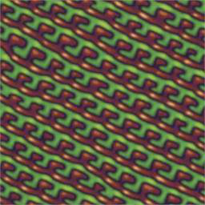
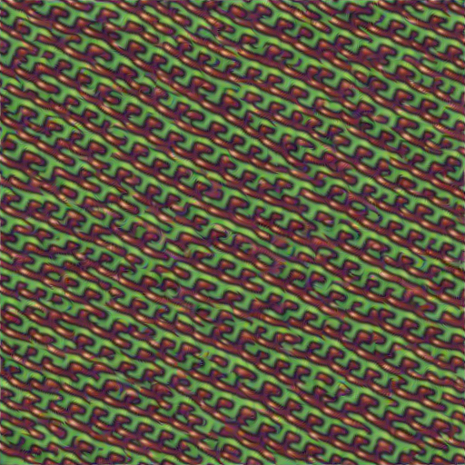
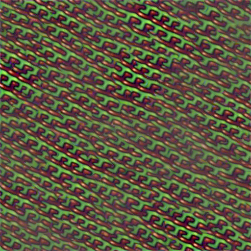

# A Sliced Wasserstein Loss for Neural Texture Synthesis

This is an unofficial **JAX** implementation.

Please see [here](https://github.com/tchambon/A-Sliced-Wasserstein-Loss-for-Neural-Texture-Synthesis) for the author's repository and cite them:

```bib
@InProceedings{Heitz_2021_CVPR,
    author = {Heitz, Eric and Vanhoey, Kenneth and Chambon, Thomas and Belcour, Laurent},
    title = {A Sliced Wasserstein Loss for Neural Texture Synthesis},
    booktitle = {IEEE/CVF Conference on Computer Vision and Pattern Recognition (CVPR)},
    month = {June},
    year = {2021}
}
```

## Notes

We require these libraries:

```bash
pip install -U "jax[cuda]" equinox optax tqdm pillow
```

The pre-trained VGG weights `vgg19.npy` is ported from the `vgg19.pth` file provided in the official repo.

We re-write the VGG network and Slice Wasserstein Loss in JAX code.

## Run

```bash
python texsyn.py --exemplar_path data/input.png --loss_type sw
```

## Results


Input | Output (Slice) | Output (Gram)
---------|----------|---------
  |  | 